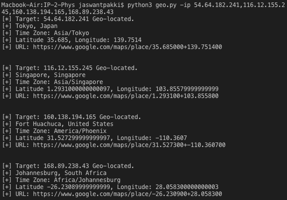

# IP-2-Phys
Command line tool that correlates IP addresses to physical locations. A tutorial followed from the book Violent Python with some added content including time zones, google maps URLs, and ability to analyze multiple IP addresses in one command. 

## Prerequisites
* Install pygeoip using the command:
` pip install pygeoip `

## Usage

` python3 geo.py -ip <target IP address(es)> `

* Multiple target IP addresses may be specified and must be separated by a commas

## Screenshots

